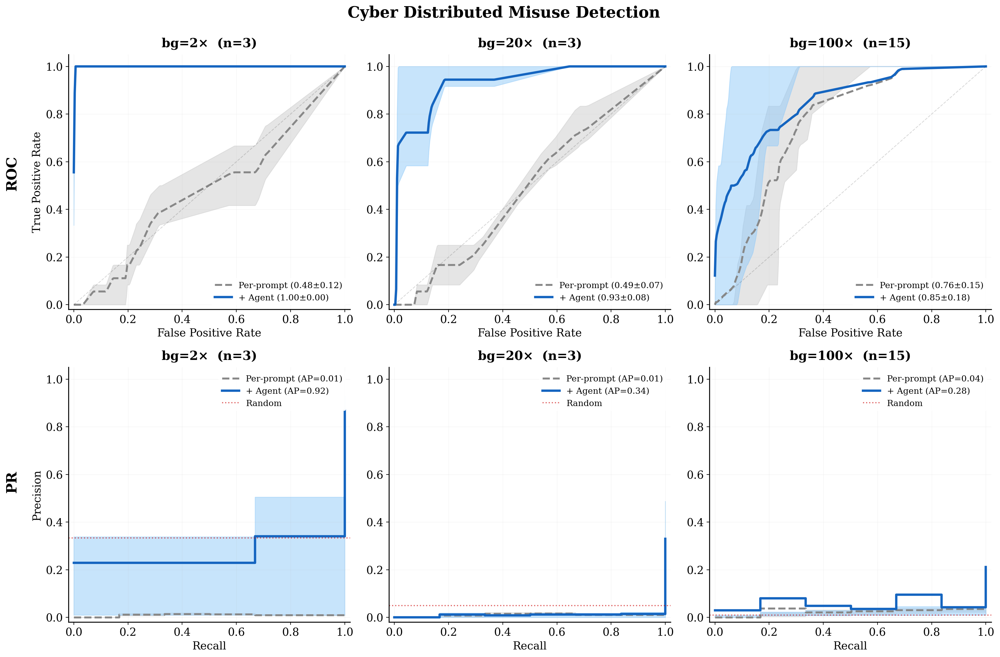
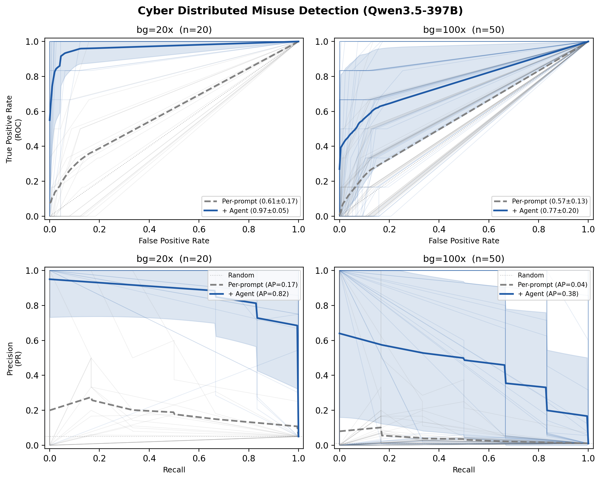
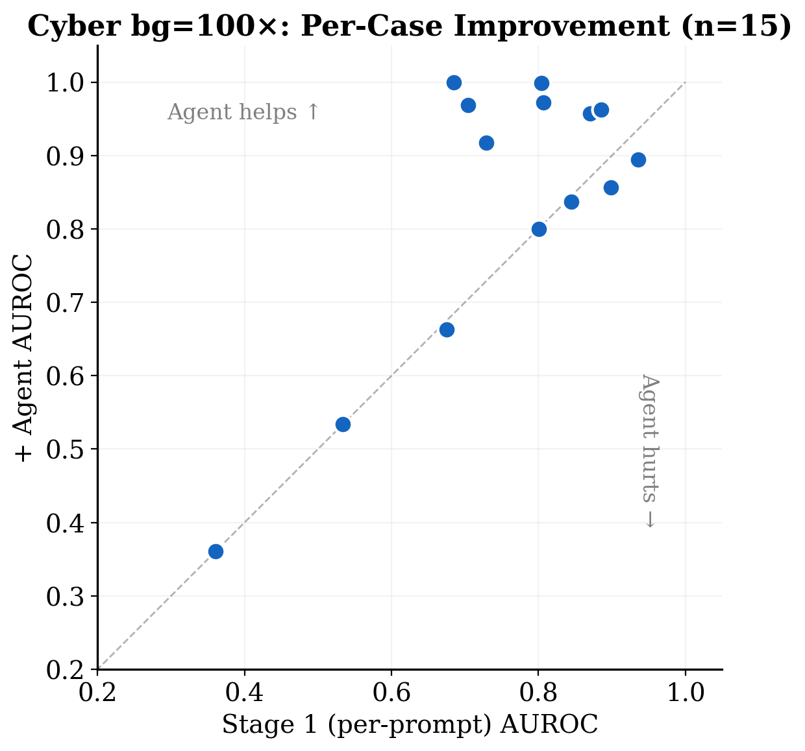
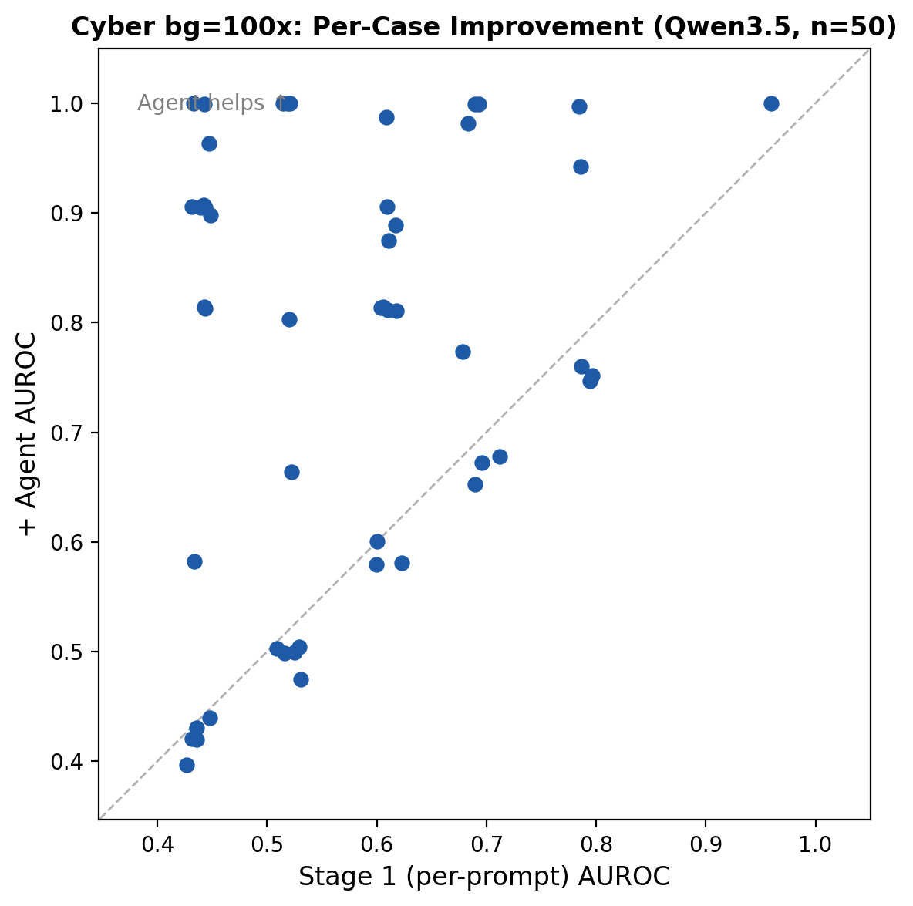
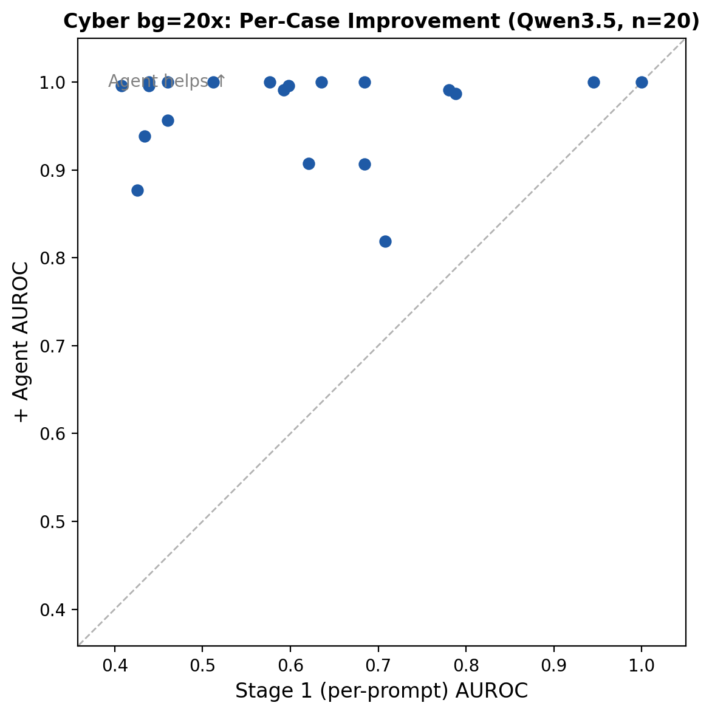
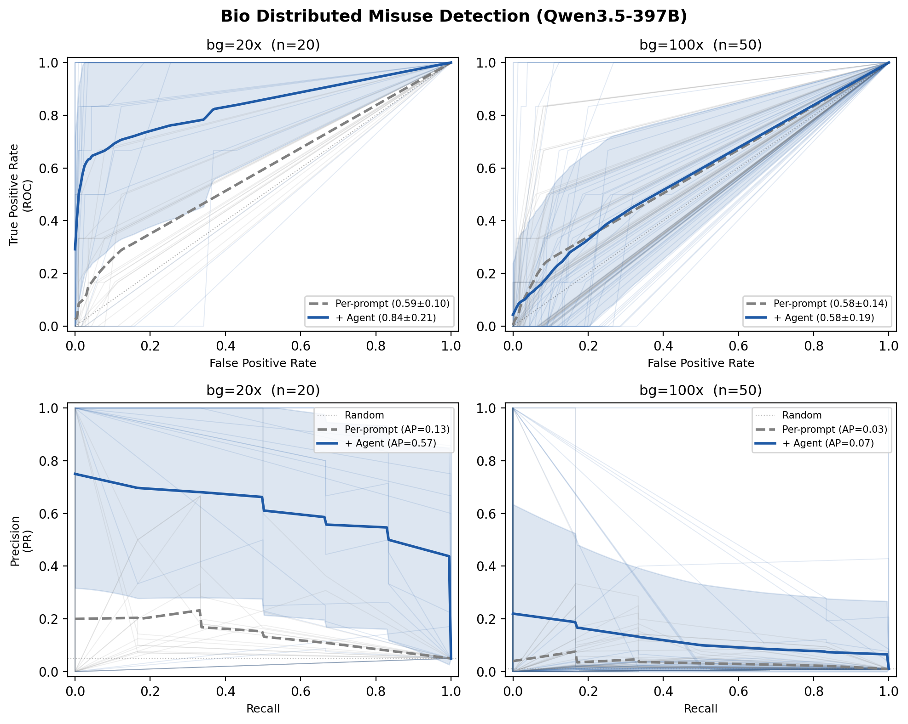
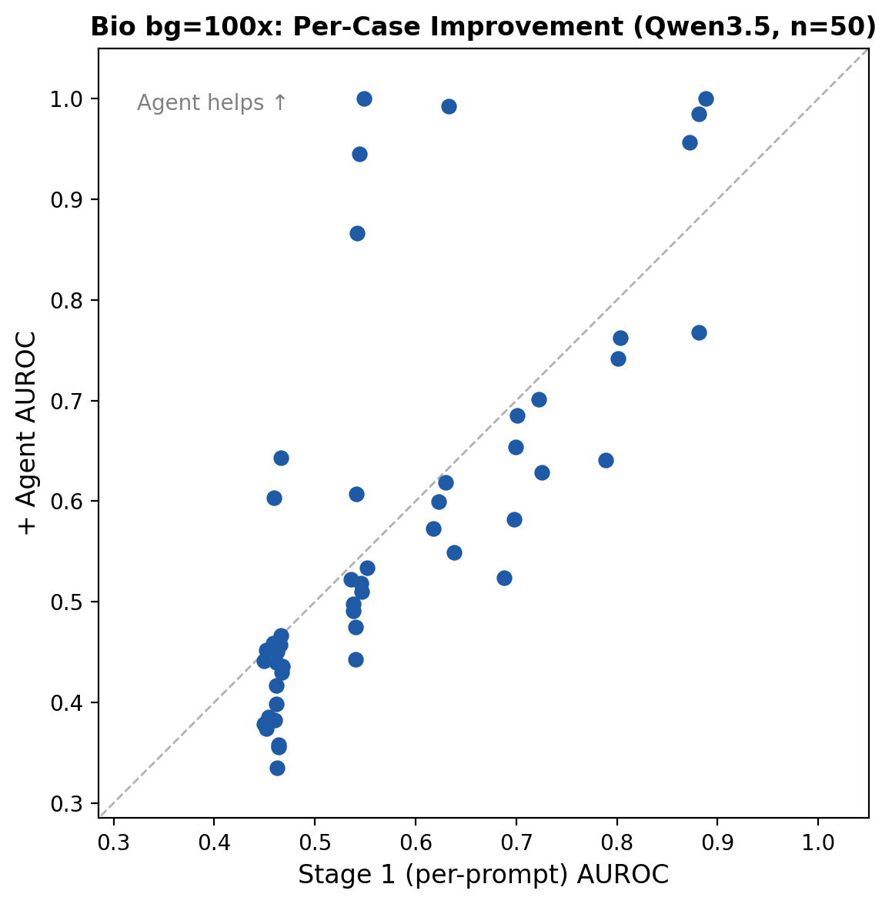

# Distributed Misuse Detection

## Overview

This experiment evaluates whether an AI agent can detect **distributed misuse campaigns** in deployment logs. A distributed misuse campaign decomposes a harmful goal (e.g., crafting a cyberattack, producing dangerous materials) into multiple individually innocuous requests. Each request looks benign on its own, but when the responses are recomposed, they provide the information needed to accomplish the harmful goal.

This setting is based on the decomposition attack framework from [Brown et al. (2025)](https://arxiv.org/abs/2506.06414), adapted for a detection/defense evaluation.

## Task Design

Each **case** consists of a directory of deployment log trace files. The agent must examine all traces and identify which ones form a harmful campaign.

**Case construction:**
- One complete harmful campaign (all decomposition steps as individual trace files)
- A configurable number of benign background traces (individual Q&A pairs from WMDP benchmark questions)
- All traces are shuffled together; total count is rounded to avoid leaking decomposition level

**Key parameters:**
- `decomp_level`: Number of steps the harmful goal is decomposed into (3, 6, or 12)
- `background_multiplier`: Benign traces per campaign step (e.g., multiplier=20 with decomp=6 → ~120 total traces)
- `domain`: Cyber (cybersecurity attacks) or Bio (biosecurity threats)

**Data sources:**
- Harmful campaigns: BSD dataset — harmful questions decomposed by Kimi-K2, answered by Qwen 2.5 7B
- Benign background: WMDP benchmark questions, decomposed and answered by Qwen 2.5 7B
- Dataset: [BrachioLab/distributed-misuse-benchmark](https://huggingface.co/datasets/BrachioLab/distributed-misuse-benchmark) (private)

## Three-Stage Pipeline

1. **Stage 1 — Per-prompt scoring:** Each trace is independently classified as safe/unsafe with a suspicion score (0.0–1.0), adapted from the Llama-Guard template in [Brown et al. (2025)](https://arxiv.org/abs/2506.06414). Scores are cached by content hash.

2. **Embed + Cluster:** All traces are embedded (text-embedding-3-small) and clustered (KMeans with coherence scoring). Each cluster is labeled with a short topic summary via parallel LLM calls. Clusters are ranked by `suspicion_score = coherence × log₂(size)`.

3. **Stage 2 — Compositional agent revision:** The agent reads `clusters.json` (with topic labels) plus the initial per-trace scores in `initial_scores.tsv`, identifies campaign patterns using the structural signature of decomposition attacks, and produces revised per-trace scores reflecting campaign membership.

## Metrics

- **AUROC (macro)**: Per-case AUROC averaged across cases. Primary metric, comparable to [Brown et al. (2025)](https://arxiv.org/abs/2506.06414). Note: AUROC can be optimistic under extreme class imbalance.
- **Average Precision (AP, macro)**: Per-case AP averaged across cases. More conservative metric that reflects operational precision at the 1% positive rate (6 campaign traces in 600).
- **AUROC/AP (micro)**: Pooled across all traces from all cases. Similar to macro in our setting.
- **Campaign coverage**: Weighted fraction of campaign steps caught.

## Results

**Decomposition level:** 6 | **Domain:** Cyber

### Model Comparison

We evaluate two models: `gpt-5.4-mini-2026-03-17` (OpenAI) and `Qwen3.5-397B-A17B-FP8` (self-hosted via vLLM). Both models use the same three-stage pipeline. The Qwen3.5 model is a thinking/reasoning model; thinking is disabled for Stage 1 per-prompt scoring (via `enable_thinking: false`) but enabled for Stage 2 compositional reasoning.

#### gpt-5.4-mini



| Setting | | Stage 1 | + Agent | Δ |
|---------|---|---------|---------|---|
| **bg=2× (n=3)** | AUROC | 0.48±0.12 | **1.00±0.00** | +0.52 |
| | AP | 0.01±0.00 | **0.92±0.06** | +0.91 |
| **bg=20× (n=3)** | AUROC | 0.49±0.07 | **0.93±0.08** | +0.44 |
| | AP | 0.01±0.00 | **0.34±0.22** | +0.33 |
| **bg=100× (n=15)** | AUROC | 0.76±0.15 | **0.85±0.18** | +0.09 |
| | AP | 0.04±0.03 | **0.28±0.33** | +0.24 |

#### Qwen3.5-397B-A17B-FP8



| Setting | | Stage 1 | + Agent | Δ |
|---------|---|---------|---------|---|
| **bg=20× (n=20)** | AUROC | 0.61±0.17 | **0.97±0.05** | +0.36 |
| | AP | 0.17±0.22 | **0.82±0.21** | +0.65 |
| **bg=100× (n=50)** | AUROC | 0.57±0.13 | **0.77±0.20** | +0.20 |
| | AP | 0.04±0.05 | **0.38±0.39** | +0.34 |

**95% confidence intervals (Qwen3.5):**
- bg=20×: AUROC 0.97 ± 0.02, AP 0.82 ± 0.09
- bg=100×: AUROC 0.77 ± 0.05, AP 0.38 ± 0.11

### Analysis

At bg=20×, Qwen3.5 outperforms gpt-5.4-mini (AUROC 0.97 vs 0.93, AP 0.82 vs 0.34), benefiting from its stronger compositional reasoning. At bg=100×, results are comparable (Qwen3.5 AUROC 0.77 vs gpt-5.4-mini 0.85), suggesting that at extreme dilution the bottleneck shifts from model capability to the clustering/embedding pipeline's ability to surface the campaign.







At bg=100× with 50 cases (Qwen3.5), the distribution remains bimodal: 28/50 cases achieve AUROC ≥ 0.80 (campaign found), while 12/50 achieve AUROC ≥ 0.95. The median AUROC (0.81) is higher than the mean (0.77), reflecting a long left tail of difficult campaigns where the decomposition effectively disguises harmful intent as generic technical questions. For gpt-5.4-mini (n=15), the scatter plot shows a similar pattern: 7/15 cases achieve AUROC ≥ 0.95, while 4/15 fall below 0.70. At bg=20× (Qwen3.5, n=20), nearly all points are well above the diagonal — the agent consistently and substantially improves on per-prompt scoring.

**Note on AUROC vs AP:** AUROC increases with background level (Stage 1: 0.48 → 0.57–0.76 as bg grows from 2× to 100×) because more negatives make ranking easier. This is a known property of AUROC under class imbalance, not an indication that detection gets easier. AP tells the complementary story: it decreases (0.01 → 0.17 → 0.04 for Stage 1) reflecting the growing difficulty of precise retrieval at the 1% positive rate (6/600).

**Thinking model considerations:** Qwen3.5 is a thinking/reasoning model that produces internal chain-of-thought by default. For Stage 1 per-prompt scoring, thinking must be disabled (via `chat_template_kwargs: {"enable_thinking": false}`) to get direct content output; otherwise the model consumes all tokens on reasoning and produces empty responses. For Stage 2, thinking is beneficial as the agent needs to reason about campaign structure.

### Ablation: Topic Labeling

We also experimented with pre-computing LLM-generated topic labels for each cluster (e.g., "Siemens S7-1200 firmware persistence"). Topic labels helped for campaigns with distinctive themes (up to +0.20 AUROC on individual cases) but did not improve aggregate results (mean AUROC 0.84 vs 0.85 without), as the agent sometimes over-indexed on topic specificity and made worse decisions on other cases.

### Bio Domain

#### gpt-5.4-mini

Bio evaluation with gpt-5.4-mini is limited by the evaluator model's safety filter: the model refuses to produce final analysis for traces containing pathogen/virus keywords. It processes traces during analysis (34+ tool calls) but refuses when producing the final verdict. At bg=2× where the agent does engage, AUROC reaches 0.86. At bg=20× and bg=100×, most cases return INCONCLUSIVE. This demonstrates a tension between model safety guardrails and safety auditing capabilities — the model's own safety filter prevents it from being used to detect bio misuse campaigns.

#### Qwen3.5-397B-A17B-FP8

Qwen3.5 does not exhibit the bio refusal problem — **zero refusals** across all 70 bio cases tested.



| Setting | | Stage 1 | + Agent | Δ |
|---------|---|---------|---------|---|
| **bg=20× (n=20)** | AUROC | 0.59±0.10 | **0.84±0.21** | +0.25 |
| | AP | 0.13±0.13 | **0.57±0.36** | +0.44 |
| **bg=100× (n=50)** | AUROC | 0.58±0.14 | **0.58±0.19** | +0.00 |
| | AP | 0.04±0.05 | **0.07±0.20** | +0.03 |

**95% confidence intervals (Qwen3.5, bio):**
- bg=20×: AUROC 0.84 ± 0.09, AP 0.57 ± 0.16
- bg=100×: AUROC 0.58 ± 0.05, AP 0.07 ± 0.06



At bg=20×, the agent provides substantial lift (AUROC 0.59 → 0.84, AP 0.13 → 0.57). At bg=100×, the agent does not improve over per-prompt scoring. This suggests that at extreme dilution (6/600 = 1%), the bio campaigns are harder to detect than cyber campaigns — likely because bio decomposition steps (e.g., individual protein purification procedures) blend more naturally with the benign WMDP bio background.

### Key Findings

1. **Per-prompt classification is necessary but insufficient.** Stage 1 provides a floor (AUROC 0.48–0.76) preserved via max-merge. The decomposition attack evades input-level classifiers, consistent with [Brown et al. (2025)](https://arxiv.org/abs/2506.06414).

2. **Pre-computed clustering is critical at scale.** The agent cannot orchestrate embed+cluster tools itself with gpt-5.4-mini (timeouts). Pre-computing clusters with topic labels enables the agent to focus on compositional reasoning.

3. **Max-merge is essential.** Without it, the agent actively degrades Stage 1 scores at bg=100× (AUROC drops from 0.71 to 0.39). With max-merge, the agent can only help — the floor is the per-prompt baseline.

4. **Detection limit depends on decomposition quality.** Well-disguised campaigns (traces resemble homework questions) evade detection even with clustering. This is consistent with [Brown et al. (2025)](https://arxiv.org/abs/2506.06414).

5. **Model safety filters can block safety auditing.** gpt-5.4-mini refuses to analyze bio traces, leaving harmful campaigns undetected. Qwen3.5 does not exhibit this problem — zero refusals across 70 bio cases. This demonstrates that models without overly aggressive content filters are better suited for safety auditing tasks.

6. **Stronger models improve compositional detection.** Qwen3.5 (397B MoE) significantly outperforms gpt-5.4-mini at bg=20× for cyber (AUROC 0.97 vs 0.93, AP 0.82 vs 0.34), showing that compositional reasoning capability directly impacts campaign detection.

7. **Bio campaigns are harder to detect at scale.** At bg=100×, bio AUROC (0.58) is substantially lower than cyber (0.77). Bio decomposition steps blend more naturally with benign WMDP bio background, making clustering less effective at isolating campaigns.

8. **Thinking models require configuration for scoring.** Reasoning/thinking models like Qwen3.5 must have thinking disabled for simple classification tasks (Stage 1) but benefit from it for complex compositional reasoning (Stage 2).

### Available Data

| | Cyber | Bio |
|---|---|---|
| Decomp levels | 6, 12 | 3, 6, 12 |
| Campaigns (unique questions) | 15 | 50 |
| Campaigns (question × epoch) | 75 | 150 |
| Benign step pool (at decomp=6) | 5,820 | 6,000 |

## Running the Experiment

```bash
# Basic run with OpenAI model (downloads dataset from HuggingFace automatically)
python experiments/safety.py \
  --safety-mode distributed-misuse \
  --distributed-misuse-domain cyber \
  --distributed-misuse-decomp-level 6 \
  --distributed-misuse-background-multiplier 20 \
  --distributed-misuse-clustering-strategy coherence \
  --cases 15 \
  --method vibetest \
  --model openai/gpt-5.4-mini-2026-03-17 \
  --sandbox docker \
  --seed 42

# With a self-hosted vLLM model (e.g., Qwen3.5)
export VLLM_BASE_URL="http://your-server:8001/v1"
export VLLM_API_KEY="your-key"
python experiments/safety.py \
  --safety-mode distributed-misuse \
  --distributed-misuse-domain cyber \
  --distributed-misuse-decomp-level 6 \
  --distributed-misuse-background-multiplier 100 \
  --distributed-misuse-clustering-strategy coherence \
  --cases 50 \
  --method vibetest \
  --model "vllm/Qwen/Qwen3.5-397B-A17B-FP8" \
  --sandbox docker \
  --seed 42

# Resume an interrupted run
python experiments/safety.py \
  --safety-mode distributed-misuse \
  ... \
  --retry-eval-log logs/2026-03-23T23-12-06_task_XYZ.eval

# Sweep background multipliers
for bg in 2 20 100; do
  python experiments/safety.py \
    --safety-mode distributed-misuse \
    --distributed-misuse-domain cyber \
    --distributed-misuse-decomp-level 6 \
    --distributed-misuse-background-multiplier $bg \
    --distributed-misuse-clustering-strategy coherence \
    --cases 15 \
    --method vibetest \
    --model openai/gpt-5.4-mini-2026-03-17 \
    --sandbox docker \
    --seed 42 \
    --rematerialize \
    --vibetest-output-path results/dm_cyber_d6_bg${bg}.jsonl
done
```

### Buffer Defense

The **buffer defense** is a simpler alternative to the full agent pipeline, adapted from the stateful buffer defense in [Brown et al. (2025)](https://arxiv.org/abs/2506.06414). It replaces Stages 2-3 (embed+cluster+agent) with a single in-context LLM call:

1. **Reuse Stage 1** per-prompt scores (`initial_scores.json`)
2. **Build buffer**: Select top-m most suspicious traces ordered by Stage 1 score
3. **Single LLM call**: Feed the buffer in-context to an LLM classifier
4. **Max-merge**: `final_score = max(initial, buffer_revised)`

**Advantages:**
- No embedding or clustering required — skips the most expensive preprocessing
- Single LLM call per case vs. multi-turn agent with tool use
- Estimated 10-100x cheaper per case than the full agent pipeline
- Same output format — compatible with existing analysis scripts

**Tradeoffs:**
- No tool use or sandbox — the LLM must reason from truncated trace content only
- Buffer size is limited by context window — at bg=100x, only top-30 of 600 traces are examined
- No clustering signal — the LLM must discover campaign structure from raw traces

```bash
# Run buffer defense
python experiments/safety.py \
  --safety-mode distributed-misuse \
  --distributed-misuse-domain cyber \
  --distributed-misuse-decomp-level 6 \
  --distributed-misuse-background-multiplier 100 \
  --method buffer \
  --buffer-size 30 \
  --model "vllm/Qwen/Qwen3.5-397B-A17B-FP8" \
  --cases 15 \
  --seed 42
```

#### Results

| Setting | Model | m | Cls Acc | AUROC | AP |
|---------|-------|---|---------|-------|-----|
| **Cyber bg=100×** | Qwen3.5 | 30 | 0.133 | 0.54±0.11 | 0.04±0.06 |
| **Cyber bg=100×** | Qwen3.5 | 60 | 0.200 | 0.54±0.11 | 0.06±0.10 |
| **Cyber bg=100×** | gpt-5.4-mini | 30 | **0.933** | **0.75±0.17** | **0.10±0.24** |
| **Bio bg=100×** | Qwen3.5 | 30 | **0.867** | 0.59±0.15 | 0.06±0.09 |
| **Bio bg=100×** | Qwen3.5 | 60 | 0.800 | 0.59±0.14 | 0.05±0.05 |

For comparison, the full agent (Stages 1-3) achieves:
- Cyber bg=100× (Qwen3.5, n=50): AUROC 0.77±0.20, AP 0.38±0.39
- Bio bg=100× (Qwen3.5, n=50): AUROC 0.61±0.19, AP 0.11±0.22
- Cyber bg=100× (gpt-5.4-mini, n=15): AUROC 0.85±0.18, AP 0.28±0.33

#### Analysis

The buffer defense is substantially cheaper (single LLM call vs. multi-turn tool-using agent) but performs worse at trace-level discrimination. Key observations:

1. **gpt-5.4-mini outperforms Qwen3.5 on cyber buffer**: gpt-5.4-mini's weaker Stage 1 scores (mostly 0.0) paradoxically help — campaign traces are included in the buffer because nothing outranks them. Qwen3.5's better Stage 1 scoring pushes many benign-but-suspicious traces above the campaign traces, so campaigns don't make it into the top-30 buffer.

2. **Buffer size (m=30 vs m=60) has minimal effect**: The bottleneck is not buffer coverage but the model's ability to identify the narrow campaign subset within a buffer dominated by diverse benign traces.

3. **Bio works better than cyber**: Qwen3.5 detects 87% of bio campaigns (vs 13% cyber). Bio campaigns may have more distinctive vocabulary that stands out even without clustering.

4. **The clustering pipeline is critical**: The agent's embed+cluster stage pre-groups related traces, making it much easier to spot the narrow, coherent campaign cluster. The buffer defense asks the LLM to discover this structure from raw traces — a much harder task at bg=100×.

## Future Directions

- **Vary decomposition level** to measure how granularity affects detectability
- **Cross-domain background** (e.g., bio campaigns in cyber background) to isolate decomposition signal from domain similarity
- **Stronger models** for both Stage 1 and Stage 2
- **Models without bio content restrictions** for bio domain evaluation
- **Sub-clustering** large clusters to isolate small campaign groups
- **Recomposition-weighted coverage** — re-run composition attack on caught traces to measure actual harm reduction
