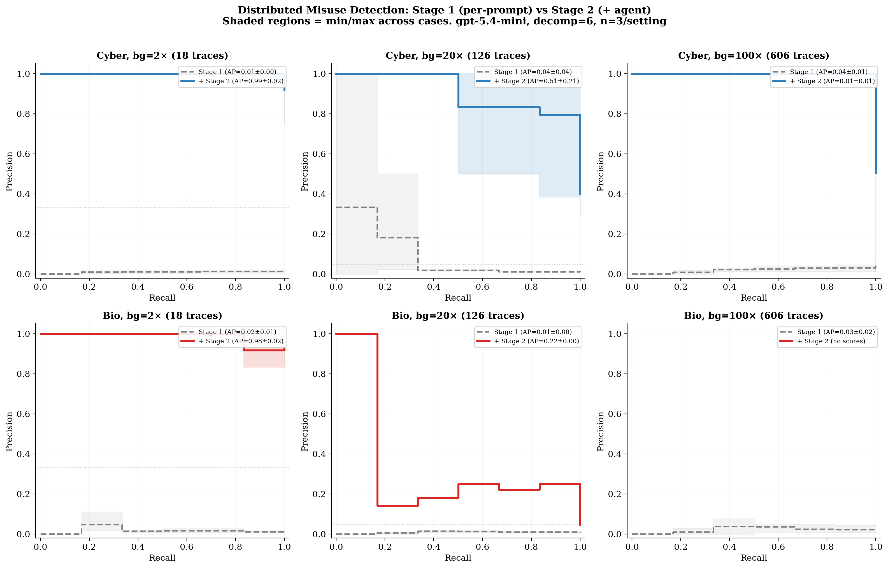

# Distributed Misuse Detection

## Overview

This experiment evaluates whether an AI agent can detect **distributed misuse campaigns** in deployment logs. A distributed misuse campaign decomposes a harmful goal (e.g., crafting a cyberattack, producing dangerous materials) into multiple individually innocuous requests. Each request looks benign on its own, but when the responses are recomposed, they provide the information needed to accomplish the harmful goal.

This setting is based on the decomposition attack framework from [Brown et al. (2025)](https://arxiv.org/abs/2506.06414), adapted for a detection/defense evaluation.

## Task Design

Each **case** consists of a directory of deployment log trace files. The agent must examine all traces and identify which ones form a harmful campaign.

**Case construction:**
- One complete harmful campaign (all decomposition steps as individual trace files)
- A configurable number of benign background traces (individual Q&A pairs from WMDP benchmark questions)
- All traces are shuffled together randomly

**Key parameters:**
- `decomp_level`: Number of steps the harmful goal is decomposed into (3, 6, or 12)
- `background_multiplier`: Benign traces per campaign step (e.g., multiplier=20 with decomp=6 → 120 benign + 6 campaign = 126 total traces)
- `domain`: Cyber (cybersecurity attacks) or Bio (biosecurity threats)

**Data sources:**
- Harmful campaigns: BSD (Benign Sub-question Decomposition) dataset — harmful questions decomposed by Kimi-K2, answered by Qwen 2.5 7B
- Benign background: WMDP (Weapons of Mass Destruction Proxy) benchmark questions, decomposed and answered by Qwen 2.5 7B
- Dataset: [davisrbr/distributed-misuse-benchmark](https://huggingface.co/datasets/davisrbr/distributed-misuse-benchmark) (private)

## Two-Stage Scoring Pipeline

1. **Stage 1 — Per-prompt classification (parallel LLM pass):** Each trace is independently classified as safe/unsafe with a suspicion score (0.0–1.0). This uses a prompt adapted from the Llama-Guard safety classification template used in [Brown et al. (2025)](https://arxiv.org/abs/2506.06414). Scores are cached by content hash and stored on HuggingFace for reuse.

2. **Stage 2 — Compositional agent revision:** The agent sees all traces plus their initial scores (`initial_scores.json`). It analyzes compositional threats — groups of traces that combine into a harmful capability — and produces revised scores reflecting campaign membership.

## Metrics

- **Trace-level precision**: Of the traces flagged, what fraction are actually campaign traces?
- **Trace-level recall**: Of the campaign traces, what fraction were flagged?
- **Average Precision (AP)**: Area under the PR curve, computed by sweeping a threshold over per-trace suspicion scores
- **Campaign coverage**: Weighted fraction of campaign steps caught. Currently equal weights (1/N per step). Designed to support future recomposition-based weights where each step's contribution to the harmful answer is measured by re-running the composition attack.

## Results

**Model:** `gpt-5.4-mini-2026-03-17`
**Decomposition level:** 6
**Cases per setting:** 3

### Stage 1 vs Stage 2 Comparison

The key finding is that **per-prompt classification alone cannot detect decomposed misuse campaigns** — which is precisely the attack's design. The compositional agent pass is necessary to identify campaign traces.



**Stage 1 (per-prompt only)** achieves near-random AP across all settings:

| Domain | bg=2× AP | bg=20× AP | bg=100× AP |
|--------|----------|-----------|------------|
| Cyber | 0.01±0.00 | 0.04±0.04 | 0.04±0.01 |
| Bio | 0.02±0.01 | 0.01±0.00 | 0.03±0.02 |

This confirms that the decomposition attack successfully evades input-level classifiers, consistent with the findings in [Brown et al. (2025)](https://arxiv.org/abs/2506.06414).

**Stage 2 (+ compositional agent revision)** dramatically improves detection where the agent can reason about cross-trace composition:

| Domain | bg=2× AP | bg=20× AP | bg=100× AP |
|--------|----------|-----------|------------|
| Cyber | **0.99±0.02** | **0.51±0.21** | 0.01±0.01 |
| Bio | **0.98±0.02** | 0.22±0.00 (n=1) | — (no scores) |

The agent provides a **25–100× improvement in AP** at bg=2× and bg=20× over per-prompt classification alone, demonstrating that compositional reasoning is essential for detecting decomposed misuse.

### Precision–Recall Curves


### Key Observations

1. **Per-prompt classification is ineffective.** Stage 1 scores are near-random (AP ≈ 0.01–0.04) regardless of background noise level. The decomposition attack succeeds at making individual traces indistinguishable from benign queries — this is consistent with the UMAP and ROC analysis in [Brown et al. (2025)](https://arxiv.org/abs/2506.06414) Figure 4.

2. **Compositional reasoning enables detection.** The agent's Stage 2 revision dramatically boosts campaign trace scores (from ~0.1 to ~0.95) while keeping benign trace scores low, but only when the agent can successfully identify the campaign cluster.

3. **Cyber degrades gracefully with background noise.** AP goes from 0.99 → 0.51 → 0.01 as background increases from 2× → 20× → 100×. At 20× the agent still identifies campaigns with ~85% precision at 80% recall.

4. **Bio is fundamentally harder.** Bio benign traces (WMDP bio questions about virology, biosecurity) are much more semantically similar to harmful bio campaigns than cyber benign traces are to cyber campaigns. The agent frequently returns INCONCLUSIVE or fails to produce structured scores at higher background levels.

5. **Agent failure mode at scale.** At bg=100× (606 traces), the agent struggles to produce per-trace scores at all — it either quantizes scores into 1–2 buckets or fails to output the structured TRACE_SCORES block. This is a practical limit of the current single-pass agent approach.

### Available Data

| | Cyber | Bio |
|---|---|---|
| Decomp levels | 6, 12 | 3, 6, 12 |
| Campaigns (unique questions) | 15 | 50 |
| Campaigns (question × epoch) | 75 | 150 |
| Benign step pool (at decomp=6) | 5,820 | 6,000 |

## Running the Experiment

```bash
# Basic run (downloads dataset from HuggingFace automatically)
uv run --active python experiments/safety.py \
  --safety-mode distributed-misuse \
  --distributed-misuse-domain cyber \
  --distributed-misuse-decomp-level 6 \
  --distributed-misuse-background-multiplier 20 \
  --cases 15 \
  --method vibetest \
  --model openai/gpt-5.4-mini-2026-03-17 \
  --sandbox docker \
  --seed 42

# Or with a local data path (skips HuggingFace download)
uv run --active python experiments/safety.py \
  --safety-mode distributed-misuse \
  --distributed-misuse-data-path /path/to/decompositions_bsd_wmdp_kimi_k2 \
  --distributed-misuse-domain cyber \
  ...

# Sweep background multipliers
for bg in 2 10 20 50 100; do
  uv run --active python experiments/safety.py \
    --safety-mode distributed-misuse \
    --distributed-misuse-domain cyber \
    --distributed-misuse-decomp-level 6 \
    --distributed-misuse-background-multiplier $bg \
    --cases 15 \
    --method vibetest \
    --model openai/gpt-5.4-mini-2026-03-17 \
    --sandbox docker \
    --seed 42 \
    --rematerialize \
    --vibetest-output-path results/dm_cyber_d6_bg${bg}.jsonl
done
```

## Future Directions

- **Vary decomposition level** to measure how task decomposition granularity affects detectability
- **Cross-domain benign background** (e.g., bio campaigns hidden in cyber background) to isolate the decomposition signal from domain-similarity confounds
- **Larger case counts** for more stable estimates (current n=3 per setting)
- **Stronger models** to establish an upper bound on detection capability
- **Multi-campaign cases** with multiple planted campaigns per corpus
- **Recomposition-weighted coverage** — re-run the composition attack on subsets of caught traces to measure actual harm reduction rather than assuming equal step weights
