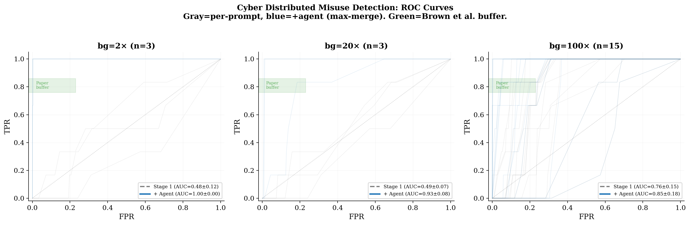

# Distributed Misuse Detection

## Overview

This experiment evaluates whether an AI agent can detect **distributed misuse campaigns** in deployment logs. A distributed misuse campaign decomposes a harmful goal (e.g., crafting a cyberattack, producing dangerous materials) into multiple individually innocuous requests. Each request looks benign on its own, but when the responses are recomposed, they provide the information needed to accomplish the harmful goal.

This setting is based on the decomposition attack framework from [Brown et al. (2025)](https://arxiv.org/abs/2506.06414), adapted for a detection/defense evaluation.

## Task Design

Each **case** consists of a directory of deployment log trace files. The agent must examine all traces and identify which ones form a harmful campaign.

**Case construction:**
- One complete harmful campaign (all decomposition steps as individual trace files)
- A configurable number of benign background traces (individual Q&A pairs from WMDP benchmark questions)
- All traces are shuffled together; total count is rounded to avoid leaking decomposition level

**Key parameters:**
- `decomp_level`: Number of steps the harmful goal is decomposed into (3, 6, or 12)
- `background_multiplier`: Benign traces per campaign step (e.g., multiplier=20 with decomp=6 → ~120 total traces)
- `domain`: Cyber (cybersecurity attacks) or Bio (biosecurity threats)

**Data sources:**
- Harmful campaigns: BSD dataset — harmful questions decomposed by Kimi-K2, answered by Qwen 2.5 7B
- Benign background: WMDP benchmark questions, decomposed and answered by Qwen 2.5 7B
- Dataset: [BrachioLab/distributed-misuse-benchmark](https://huggingface.co/datasets/BrachioLab/distributed-misuse-benchmark) (private)

## Three-Stage Pipeline

1. **Stage 1 — Per-prompt scoring:** Each trace is independently classified as safe/unsafe with a suspicion score (0.0–1.0), adapted from the Llama-Guard template in [Brown et al. (2025)](https://arxiv.org/abs/2506.06414). Scores are cached by content hash.

2. **Embed + Cluster:** All traces are embedded (text-embedding-3-small) and clustered (KMeans with coherence scoring). Clusters are ranked by `suspicion_score = coherence × log₂(size)`. Written as `clusters.json` for the agent.

3. **Stage 2 — Compositional agent:** The agent reads `clusters.json` + `initial_scores.json`, identifies campaign patterns using the structural signature of decomposition attacks, and produces revised per-trace scores. Uses max-merge: `final_score = max(initial, agent_revised)` so the agent can only boost, never degrade.

## Metrics

- **AUROC**: Primary metric, comparable to [Brown et al. (2025)](https://arxiv.org/abs/2506.06414)
- **Average Precision (AP)**: Area under PR curve — penalized by class imbalance (6 traces in 600)
- **Campaign coverage**: Weighted fraction of campaign steps caught

## Results

**Model:** `gpt-5.4-mini-2026-03-17` | **Decomposition level:** 6

### Cyber Domain



| Setting | Stage 1 AUROC | + Agent AUROC | Brown et al. buffer |
|---------|---------------|---------------|---------------------|
| **bg=2× (n=3)** | 0.48±0.12 | **1.00±0.00** | — |
| **bg=20× (n=3)** | 0.49±0.07 | **0.93±0.08** | — |
| **bg=100× (n=15)** | 0.76±0.15 | **0.85±0.18** | 0.76–0.86 |

At bg=100× with n=15 cases, the agent achieves AUROC **0.85 (median 0.92)**, matching the paper's stateful buffer defense (0.76–0.86). The distribution is bimodal: 7/15 cases ≥ 0.95 (campaign found), 4/15 < 0.70 (campaign too well-disguised).

### Bio Domain

Bio evaluation is limited by the evaluator model's safety filter: `gpt-5.4-mini` refuses to produce final analysis for traces containing pathogen/virus keywords. The model processes traces during analysis but refuses on submission. At bg=2× where it engages, AUROC reaches 0.86. At higher bg, most cases return INCONCLUSIVE. This demonstrates a tension between model safety guardrails and safety auditing capabilities.

### Key Findings

1. **Per-prompt classification is necessary but insufficient.** Stage 1 provides a floor (AUROC 0.48–0.76) preserved via max-merge. The decomposition attack evades input-level classifiers, consistent with [Brown et al. (2025)](https://arxiv.org/abs/2506.06414).

2. **Pre-computed clustering is critical at scale.** The agent cannot orchestrate embed+cluster tools itself with gpt-5.4-mini (timeouts). Pre-computing clusters enables the agent to focus on compositional reasoning.

3. **Teaching the decomposition signature matters.** Prompting the agent with the structural pattern of campaigns (narrow focus, systematic coverage, individually boring) improved one bg=100 case from AUROC 0.70 to 0.98.

4. **Detection limit depends on decomposition quality.** Well-disguised campaigns (traces resemble homework questions) evade detection even with clustering. This is consistent with [Brown et al. (2025)](https://arxiv.org/abs/2506.06414).

5. **The evaluator model's safety filter blocks bio auditing.** The model refuses to summarize findings about bio-threat content, leaving harmful campaigns undetected — an ironic failure mode for a safety tool.

### Available Data

| | Cyber | Bio |
|---|---|---|
| Decomp levels | 6, 12 | 3, 6, 12 |
| Campaigns (unique questions) | 15 | 50 |
| Campaigns (question × epoch) | 75 | 150 |
| Benign step pool (at decomp=6) | 5,820 | 6,000 |

## Running the Experiment

```bash
# Basic run (downloads dataset from HuggingFace automatically)
uv run --active python experiments/safety.py \
  --safety-mode distributed-misuse \
  --distributed-misuse-domain cyber \
  --distributed-misuse-decomp-level 6 \
  --distributed-misuse-background-multiplier 20 \
  --distributed-misuse-clustering-strategy coherence \
  --cases 15 \
  --method vibetest \
  --model openai/gpt-5.4-mini-2026-03-17 \
  --sandbox docker \
  --seed 42

# Sweep background multipliers
for bg in 2 20 100; do
  uv run --active python experiments/safety.py \
    --safety-mode distributed-misuse \
    --distributed-misuse-domain cyber \
    --distributed-misuse-decomp-level 6 \
    --distributed-misuse-background-multiplier $bg \
    --distributed-misuse-clustering-strategy coherence \
    --cases 15 \
    --method vibetest \
    --model openai/gpt-5.4-mini-2026-03-17 \
    --sandbox docker \
    --seed 42 \
    --rematerialize \
    --vibetest-output-path results/dm_cyber_d6_bg${bg}.jsonl
done
```

## Future Directions

- **Vary decomposition level** to measure how granularity affects detectability
- **Cross-domain background** (e.g., bio campaigns in cyber background) to isolate decomposition signal from domain similarity
- **Stronger models** for both Stage 1 and Stage 2
- **Models without bio content restrictions** for bio domain evaluation
- **Multi-campaign cases** with multiple planted campaigns per corpus
- **Recomposition-weighted coverage** — re-run composition attack on caught traces to measure actual harm reduction
