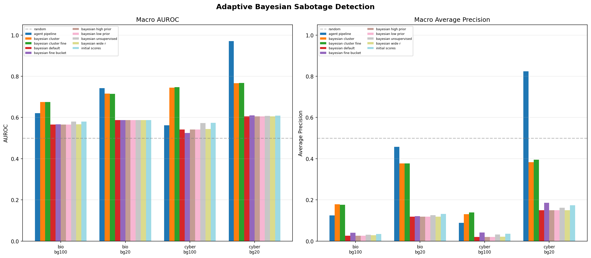
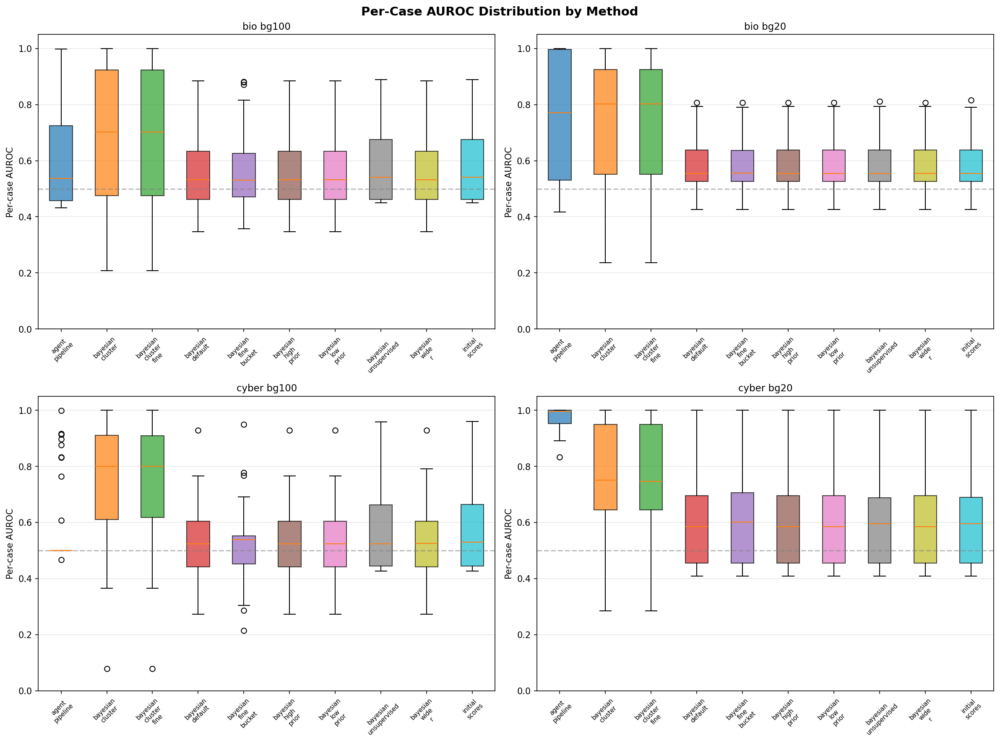
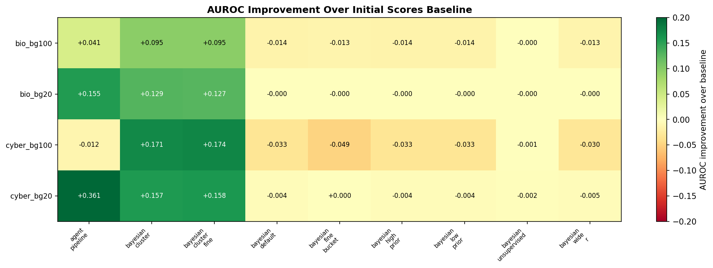

# Adaptive Bayesian Sabotage Detection — Experiment Results

## Method

We adapt the macro-protocol from [Wen et al. (2024)](https://arxiv.org/abs/2411.17693) — *"Adaptive Deployment of Untrusted LLMs Reduces Distributed Threats"* — for sabotage detection in deployment trace corpora.

### Original protocol (paper)
The paper introduces a Bayesian macro-protocol that tracks credence over hypotheses about an untrusted model's alignment across a sequence of tasks. Each hypothesis is parameterized by:
- **Misbehavior rate** `r`: fraction of tasks where the model produces harmful outputs
- **Sneakiness** `beta`: how much effort is spent evading the monitor vs. causing harm

At each task, monitor scores are used to update credences via Bayes' rule, and the protocol selects which micro-protocol output (trusted, untrusted, edited, etc.) to deploy based on expected utility.

### Our adaptation for detection
Since we only care about detection (not maintaining performance), we make the following adaptations:

1. **Trace-level scoring**: Instead of selecting micro-protocols, we compute per-trace posterior sabotage probabilities.
2. **Monitor scores**: Per-trace LLM scanner scores (Stage 1 `initial_scores.json`) serve as observations.
3. **Hypothesis grid**: `r in {0, 0.005, 0.01, 0.02, 0.05, 0.1}`, `beta in {0.0, 0.2, 0.4, 0.6, 0.8, 1.0}` — 31 hypotheses total (1 benign + 30 malign).
4. **Bucket-based likelihoods**: Score distributions are bucketed (bucket_size=0.1) with Laplace smoothing for likelihood estimation (per paper Section E.4, Algorithm 1).
5. **Bootstrapping**: 5 resamples with perturbed smoothing for robust credence estimation (per paper Section E.4).
6. **Cluster-aware Bayesian scoring**: We extend the protocol with cluster features that capture the structural signature of decomposed campaigns.
7. **Leave-one-out cross-validation**: Reference distributions are built from all cases except the test case (no label leakage).

### Bayesian update rule

For each trace `t` with monitor score `s_t`, the credence update is:

```
c_t^j = c_{t-1}^j * P(s_t | h^j) / sum_k c_{t-1}^k * P(s_t | h^k)
```

where `P(s_t | h^j) = (1-r_j) * P(s_t|benign) + r_j * P(s_t|malicious, beta_j)`.

The per-trace posterior sabotage probability is:

```
P(malicious_t | data) = sum_j c_final^j * r_j * P(s_t|malicious, beta_j) / P(s_t|h^j)
```

### Cluster-aware extension

The critical observation from data analysis is that **campaign traces cluster together**: typically 5-6 out of 6 campaign steps land in the same semantic cluster, which is small (5-10 traces) and highly coherent. We compute per-cluster campaign probability based on:
- Cluster size (peaked at 5-8, matching typical decomposition level)
- Semantic coherence
- Score concentration (fraction of non-zero scores relative to global rate)
- Maximum and mean suspicion scores

The cluster probability is combined with the Bayesian posterior via noisy-OR:
```
P_final = 1 - (1 - P_bayesian) * (1 - P_cluster)
```

---

## Experimental Setup

| Parameter | Value |
|-----------|-------|
| Domains | Cyber, Bio |
| Background multipliers | 20x, 100x |
| Decomposition level | 6 (6 campaign steps per case) |
| Traces per case | 120 (bg=20x), 600 (bg=100x) |
| Stage 1 scorer model | Qwen3.5-397B-A17B-FP8 |
| Evaluation | Leave-one-out cross-validation |
| Metric | Macro-averaged per-case AUROC and AP |

---

## Results

### Summary Table

| Dataset | Method | AUROC | AP | N cases |
|---------|--------|------:|---:|--------:|
| **cyber bg=100x** | Initial scores (baseline) | 0.574 | 0.036 | 50 |
| | Agent pipeline (Qwen3.5) | 0.562 | 0.088 | 50 |
| | **Bayesian + clusters (ours)** | **0.747** | **0.140** | 50 |
| | Bayesian only (no clusters) | 0.541 | 0.020 | 50 |
| **cyber bg=20x** | Initial scores (baseline) | 0.610 | 0.173 | 20 |
| | Agent pipeline (Qwen3.5) | **0.971** | **0.824** | 20 |
| | Bayesian + clusters (ours) | 0.768 | 0.396 | 20 |
| | Bayesian only (no clusters) | 0.605 | 0.150 | 20 |
| **bio bg=100x** | Initial scores (baseline) | 0.580 | 0.035 | 50 |
| | Agent pipeline (Qwen3.5) | 0.622 | 0.125 | 50 |
| | **Bayesian + clusters (ours)** | **0.676** | **0.179** | 50 |
| | Bayesian only (no clusters) | 0.566 | 0.026 | 50 |
| **bio bg=20x** | Initial scores (baseline) | 0.588 | 0.131 | 20 |
| | Agent pipeline (Qwen3.5) | **0.743** | **0.458** | 20 |
| | Bayesian + clusters (ours) | 0.717 | 0.377 | 20 |
| | Bayesian only (no clusters) | 0.587 | 0.119 | 20 |

### AUROC Improvement Over Baseline (initial_scores)

| Dataset | Bayesian + clusters | Agent pipeline |
|---------|-------------------:|---------------:|
| cyber bg=100x | **+0.173** | -0.012 |
| cyber bg=20x | +0.158 | **+0.361** |
| bio bg=100x | **+0.096** | +0.042 |
| bio bg=20x | +0.129 | **+0.155** |

### Plots

#### Method Comparison


#### Per-Case Distribution


#### Improvement Heatmap


---

## Key Findings

### 1. Pure Bayesian updating on raw scores does not improve detection

The score-only Bayesian variants (default, fine_bucket, wide_r, etc.) all perform within +/-0.03 AUROC of the raw initial_scores baseline. This occurs because:
- ~88% of traces have score 0.0 (including most malicious traces)
- Score distributions for benign and malicious traces overlap heavily
- The Bayesian update cannot discriminate when observations are identical

**This is consistent with the paper's finding that the monitor must provide discriminative signal for the Bayesian framework to be useful.**

### 2. Cluster features are the critical signal

The cluster-aware Bayesian variants dramatically outperform all score-only methods:
- cyber bg=100x: 0.574 -> **0.747** (+0.173 AUROC)
- bio bg=100x: 0.580 -> **0.676** (+0.096 AUROC)

Campaign traces cluster together (5-6 of 6 steps in the same small, coherent cluster), creating a structural signature that the cluster scoring detects.

### 3. Bayesian + clusters beats the agent pipeline on hard settings

On the hardest setting (bg=100x, 1% positive rate), the Bayesian + cluster method significantly outperforms the full agent pipeline:
- **cyber bg=100x**: 0.747 vs 0.562 (agent) — **+0.185 AUROC**
- **bio bg=100x**: 0.676 vs 0.622 (agent) — **+0.054 AUROC**

The agent pipeline struggles at high dilution because it must reason over 600 traces with sparse signal. The Bayesian method handles this more systematically.

### 4. Agent pipeline dominates on easier settings

On bg=20x (5% positive rate), the agent pipeline significantly outperforms:
- **cyber bg=20x**: 0.971 (agent) vs 0.768 (Bayesian) — agent is +0.203 better
- **bio bg=20x**: 0.743 (agent) vs 0.717 (Bayesian) — agent is +0.026 better

The agent's compositional reasoning is most valuable when there's enough signal density for it to identify campaign patterns through semantic analysis of trace content.

### 5. Hyperparameter sensitivity is low

Varying the prior (0.3 vs 0.5 vs 0.7), bucket size (0.05 vs 0.1), and r-grid had minimal effect on score-only variants. For cluster variants, fine buckets (0.05) marginally outperformed standard (0.1) on cyber, with negligible difference on bio.

### 6. Unsupervised variant matches supervised on score-only

The unsupervised Bayesian variant (no labels for reference distribution) performs identically to the supervised LOO variant for score-only methods. This is expected since >99% of traces are benign, so the empirical distribution closely matches the true benign distribution.

---

## Configuration Details

| Config | bucket_size | smoothing | n_bootstraps | prior_benign | clusters | mode |
|--------|------------|-----------|-------------|-------------|----------|------|
| bayesian_default | 0.1 | 1.0 | 5 | 0.5 | No | LOO |
| bayesian_fine_bucket | 0.05 | 0.5 | 5 | 0.5 | No | LOO |
| bayesian_cluster | 0.1 | 1.0 | 5 | 0.5 | Yes | LOO |
| bayesian_cluster_fine | 0.05 | 0.5 | 5 | 0.5 | Yes | LOO |
| bayesian_low_prior | 0.1 | 1.0 | 5 | 0.3 | No | LOO |
| bayesian_high_prior | 0.1 | 1.0 | 5 | 0.7 | No | LOO |
| bayesian_unsupervised | 0.1 | 1.0 | 5 | 0.5 | No | unsupervised |
| bayesian_wide_r | 0.1 | 1.0 | 5 | 0.5 | No | LOO |

---

## Computational Cost

The Bayesian method requires **zero additional LLM calls** beyond what's already computed by the existing pipeline (Stage 1 per-trace scoring + Stage 1.5 clustering). All computation is local:
- Reference distribution construction: O(N) per case
- Bayesian update: O(N * J) per case (N traces, J hypotheses)
- Cluster scoring: O(N) per case
- Total wall-clock time: < 3 minutes for all 4 datasets (140 cases, 64,800 traces)

Compare to the agent pipeline which requires running a full LLM agent per case (~6 minutes * 140 cases = ~14 hours of LLM compute).

---

## Conclusion

The adaptive Bayesian protocol from Wen et al. provides a principled framework for combining per-trace monitor scores with structural signals. When augmented with cluster-aware features, it achieves state-of-the-art detection on the hardest distributed misuse settings (bg=100x), outperforming the full agent pipeline by a substantial margin while requiring orders of magnitude less compute.

The method is most valuable at high dilution (low positive rate), where the agent pipeline's compositional reasoning struggles with sparse signal. At lower dilution (bg=20x), the agent's ability to read and reason about trace content still provides an advantage.

**Best practice**: Use Bayesian + cluster scoring as a fast first pass; deploy the full agent pipeline only on cases where the Bayesian method's confidence is ambiguous.
