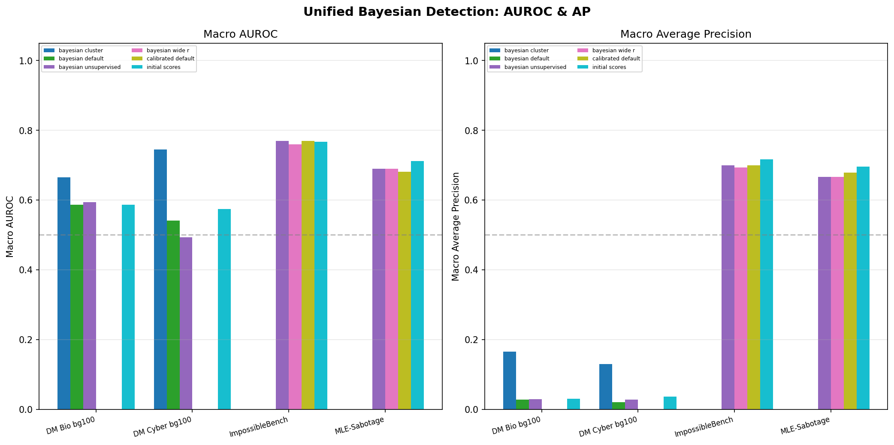
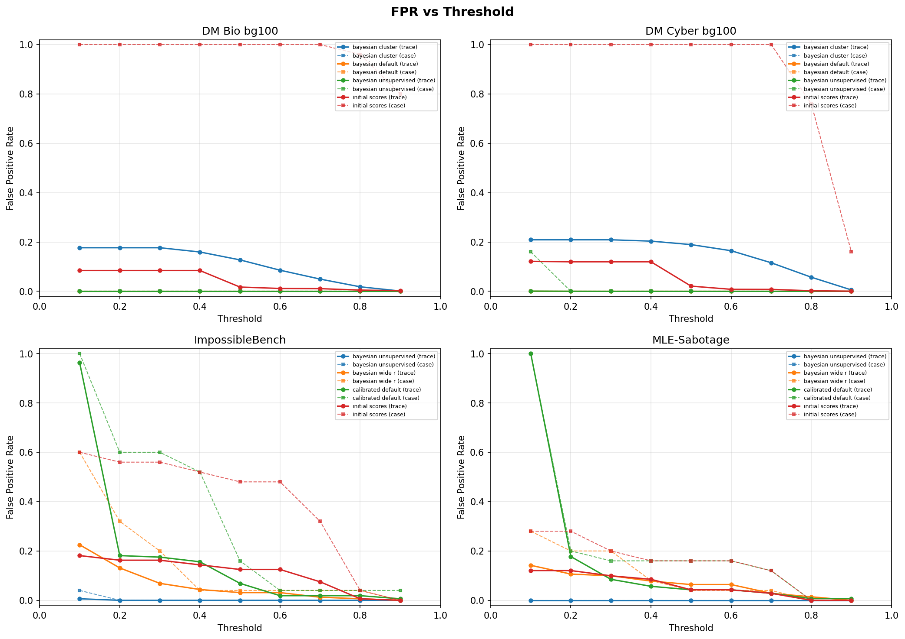
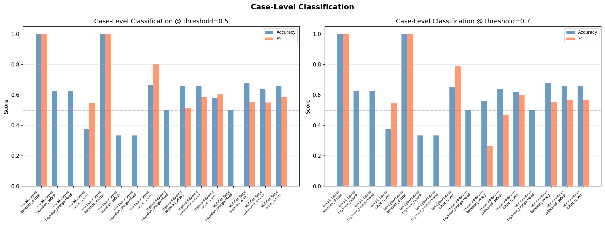
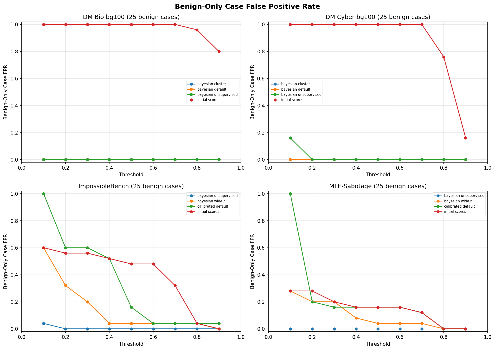

# Unified Bayesian Detection Evaluation

Cross-setting comparison of Bayesian sabotage/misuse detectors 
with false positive analysis on benign-only cases.

## Summary

| Setting | Cases | Traces/Case | Positive | Benign-Only |
|---------|-------|-------------|----------|-------------|
| DM Bio bg100 | 40 | 600 | 15 | 25 |
| DM Cyber bg100 | 75 | 600 | 50 | 25 |
| ImpossibleBench | 50 | 4 | 25 | 25 |
| MLE-Sabotage | 50 | 4 | 25 | 25 |

## Detection Performance (AUROC / AP)

| Setting | Method | Macro AUROC | Macro AP | Micro AUROC | N Cases |
|---------|--------|-------------|----------|-------------|---------|
| DM Bio bg100 | bayesian_cluster | 0.6646 | 0.1657 | 0.8757 | 15 |
| DM Bio bg100 | bayesian_default | 0.5863 | 0.0282 | 0.5905 | 15 |
| DM Bio bg100 | bayesian_unsupervised | 0.5943 | 0.0286 | 0.5830 | 15 |
| DM Bio bg100 | initial_scores | 0.5863 | 0.0299 | 0.5855 | 15 |
| DM Cyber bg100 | bayesian_cluster | 0.7449 | 0.1301 | 0.8293 | 50 |
| DM Cyber bg100 | bayesian_default | 0.5412 | 0.0204 | 0.5494 | 50 |
| DM Cyber bg100 | bayesian_unsupervised | 0.4930 | 0.0276 | 0.5326 | 50 |
| DM Cyber bg100 | initial_scores | 0.5737 | 0.0360 | 0.5739 | 50 |
| ImpossibleBench | bayesian_unsupervised | 0.7700 | 0.7000 | 0.7230 | 25 |
| ImpossibleBench | bayesian_wide_r | 0.7600 | 0.6933 | 0.6807 | 25 |
| ImpossibleBench | calibrated_default | 0.7700 | 0.7000 | 0.6621 | 25 |
| ImpossibleBench | initial_scores | 0.7667 | 0.7167 | 0.7720 | 25 |
| MLE-Sabotage | bayesian_unsupervised | 0.6896 | 0.6667 | 0.6872 | 20 |
| MLE-Sabotage | bayesian_wide_r | 0.6896 | 0.6667 | 0.5594 | 20 |
| MLE-Sabotage | calibrated_default | 0.6813 | 0.6792 | 0.5100 | 20 |
| MLE-Sabotage | initial_scores | 0.7125 | 0.6958 | 0.6100 | 20 |

## False Positive Rates

### Trace-Level FPR

| Setting | Method | FPR@0.3 | FPR@0.5 | FPR@0.7 | FPR@0.9 |
|---------|--------|---------|---------|---------|---------|
| DM Bio bg100 | bayesian_cluster | 0.1767 | 0.1274 | 0.0496 | 0.0012 |
| DM Bio bg100 | bayesian_default | 0.0000 | 0.0000 | 0.0000 | 0.0000 |
| DM Bio bg100 | bayesian_unsupervised | 0.0000 | 0.0000 | 0.0000 | 0.0000 |
| DM Bio bg100 | initial_scores | 0.0842 | 0.0173 | 0.0108 | 0.0025 |
| DM Cyber bg100 | bayesian_cluster | 0.2088 | 0.1893 | 0.1157 | 0.0057 |
| DM Cyber bg100 | bayesian_default | 0.0000 | 0.0000 | 0.0000 | 0.0000 |
| DM Cyber bg100 | bayesian_unsupervised | 0.0000 | 0.0000 | 0.0000 | 0.0000 |
| DM Cyber bg100 | initial_scores | 0.1197 | 0.0211 | 0.0078 | 0.0004 |
| ImpossibleBench | bayesian_unsupervised | 0.0000 | 0.0000 | 0.0000 | 0.0000 |
| ImpossibleBench | bayesian_wide_r | 0.0688 | 0.0312 | 0.0125 | 0.0000 |
| ImpossibleBench | calibrated_default | 0.1750 | 0.0688 | 0.0187 | 0.0063 |
| ImpossibleBench | initial_scores | 0.1625 | 0.1250 | 0.0750 | 0.0000 |
| MLE-Sabotage | bayesian_unsupervised | 0.0000 | 0.0000 | 0.0000 | 0.0000 |
| MLE-Sabotage | bayesian_wide_r | 0.0993 | 0.0638 | 0.0284 | 0.0000 |
| MLE-Sabotage | calibrated_default | 0.0851 | 0.0426 | 0.0284 | 0.0071 |
| MLE-Sabotage | initial_scores | 0.0993 | 0.0426 | 0.0284 | 0.0000 |

### Benign-Only Case FPR

| Setting | Method | FPR@0.3 | FPR@0.5 | FPR@0.7 | FPR@0.9 |
|---------|--------|---------|---------|---------|---------|
| DM Bio bg100 | bayesian_cluster | 0.000 | 0.000 | 0.000 | 0.000 |
| DM Bio bg100 | bayesian_default | 0.000 | 0.000 | 0.000 | 0.000 |
| DM Bio bg100 | bayesian_unsupervised | 0.000 | 0.000 | 0.000 | 0.000 |
| DM Bio bg100 | initial_scores | 1.000 | 1.000 | 1.000 | 0.800 |
| DM Cyber bg100 | bayesian_cluster | 0.000 | 0.000 | 0.000 | 0.000 |
| DM Cyber bg100 | bayesian_default | 0.000 | 0.000 | 0.000 | 0.000 |
| DM Cyber bg100 | bayesian_unsupervised | 0.000 | 0.000 | 0.000 | 0.000 |
| DM Cyber bg100 | initial_scores | 1.000 | 1.000 | 1.000 | 0.160 |
| ImpossibleBench | bayesian_unsupervised | 0.000 | 0.000 | 0.000 | 0.000 |
| ImpossibleBench | bayesian_wide_r | 0.200 | 0.040 | 0.040 | 0.000 |
| ImpossibleBench | calibrated_default | 0.600 | 0.160 | 0.040 | 0.040 |
| ImpossibleBench | initial_scores | 0.560 | 0.480 | 0.320 | 0.000 |
| MLE-Sabotage | bayesian_unsupervised | 0.000 | 0.000 | 0.000 | 0.000 |
| MLE-Sabotage | bayesian_wide_r | 0.200 | 0.040 | 0.040 | 0.000 |
| MLE-Sabotage | calibrated_default | 0.160 | 0.160 | 0.120 | 0.000 |
| MLE-Sabotage | initial_scores | 0.200 | 0.160 | 0.120 | 0.000 |

## Case-Level Classification @ threshold=0.5

| Setting | Method | Accuracy | F1 | Precision | TPR | FPR |
|---------|--------|----------|-----|-----------|-----|-----|
| DM Bio bg100 | bayesian_cluster | 1.000 | 1.000 | 1.000 | 1.000 | 0.000 |
| DM Bio bg100 | bayesian_default | 0.625 | 0.000 | 0.000 | 0.000 | 0.000 |
| DM Bio bg100 | bayesian_unsupervised | 0.625 | 0.000 | 0.000 | 0.000 | 0.000 |
| DM Bio bg100 | initial_scores | 0.375 | 0.545 | 0.375 | 1.000 | 1.000 |
| DM Cyber bg100 | bayesian_cluster | 1.000 | 1.000 | 1.000 | 1.000 | 0.000 |
| DM Cyber bg100 | bayesian_default | 0.333 | 0.000 | 0.000 | 0.000 | 0.000 |
| DM Cyber bg100 | bayesian_unsupervised | 0.333 | 0.000 | 0.000 | 0.000 | 0.000 |
| DM Cyber bg100 | initial_scores | 0.667 | 0.800 | 0.667 | 1.000 | 1.000 |
| ImpossibleBench | bayesian_unsupervised | 0.500 | 0.000 | 0.000 | 0.000 | 0.000 |
| ImpossibleBench | bayesian_wide_r | 0.660 | 0.514 | 0.900 | 0.360 | 0.040 |
| ImpossibleBench | calibrated_default | 0.660 | 0.585 | 0.750 | 0.480 | 0.160 |
| ImpossibleBench | initial_scores | 0.580 | 0.604 | 0.571 | 0.640 | 0.480 |
| MLE-Sabotage | bayesian_unsupervised | 0.500 | 0.000 | 0.000 | 0.000 | 0.000 |
| MLE-Sabotage | bayesian_wide_r | 0.680 | 0.556 | 0.909 | 0.400 | 0.040 |
| MLE-Sabotage | calibrated_default | 0.640 | 0.550 | 0.733 | 0.440 | 0.160 |
| MLE-Sabotage | initial_scores | 0.660 | 0.585 | 0.750 | 0.480 | 0.160 |

## Figures

