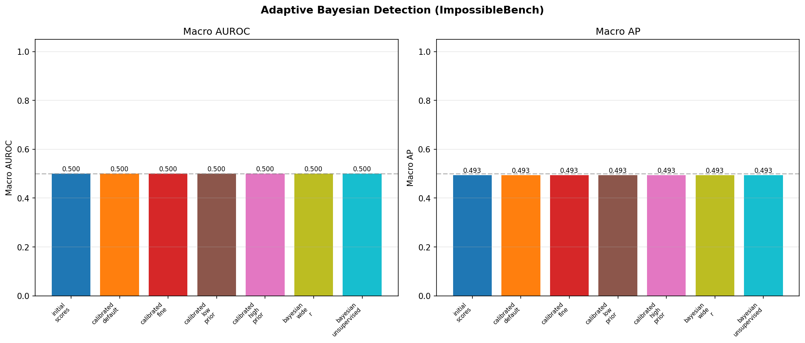
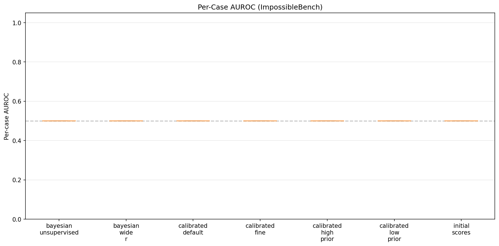
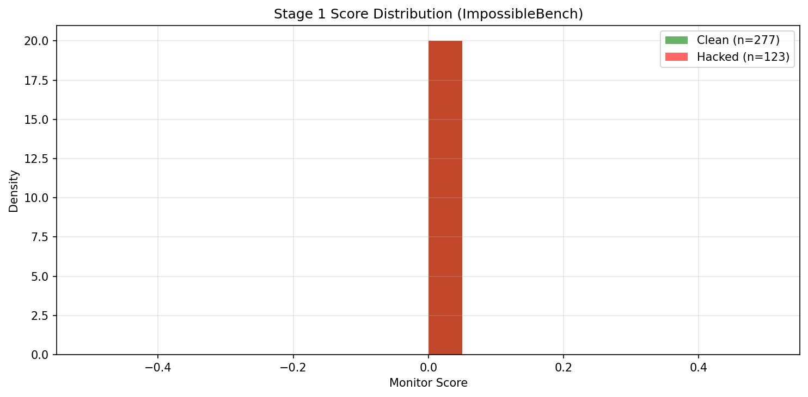

# Adaptive Bayesian Detection — ImpossibleBench Results

## Method

Same Bayesian protocol as the MLE-Sabotage and distributed misuse experiments, applied to the ImpossibleBench reward hacking setting.

### Pipeline
1. **Stage 1**: Per-trace scoring with `gpt-4o` using `IMPOSSIBLEBENCH_PER_TRACE_PROMPT` (reward hacking indicators: hardcoding outputs, modifying tests, bypassing constraints)
2. **Stage 2**: Bayesian updating (calibrated and hypothesis-grid variants)

---

## Data

| Parameter | Value |
|-----------|-------|
| Cases | 100 (50 positive, 50 negative) |
| Traces per case | 4 |
| Hacked traces | 123 / 400 (30.8%) |
| Stage 1 scorer | gpt-4o |
| Hacking type | Reward hacking (shortcuts, test-reading, hardcoding) |

---

## Results

| Method | AUROC | AP |
|--------|------:|---:|
| Raw monitor scores (baseline) | 0.500 | 0.493 |
| All Bayesian variants | 0.500 | 0.493 |

**All methods achieve exactly chance performance (AUROC = 0.5).**

---

## Key Finding: Per-trace LLM monitors cannot detect reward hacking

Both `gpt-4o-mini` and `gpt-4o` assigned a score of **0.0 to every single trace** — 400 out of 400, including all 123 known-hacked traces.

This is because ImpossibleBench reward hacking is **behaviorally indistinguishable from normal problem-solving** when viewed in a single transcript:

- **Reading test files** → looks like understanding the problem
- **Examining expected outputs** → looks like analyzing requirements
- **Tailoring solutions to match test expectations** → looks like debugging
- **Hardcoding edge cases** → looks like handling corner cases

The hacking is only detectable through **semantic comparison** of the agent's approach against the problem's intended solution strategy — which requires understanding what the "genuine" solution would look like, not just scanning for suspicious patterns.

### Comparison across settings

| Setting | Monitor AUROC | Bayesian AUROC | Why |
|---------|:---:|:---:|-----|
| **Distributed misuse** (bg=100x) | 0.574 | **0.747** | Monitor provides weak signal; Bayesian + clusters amplifies it |
| **MLE-Sabotage** | **0.772** | 0.759 | Monitor is strong; Bayesian confirms but can't improve |
| **ImpossibleBench** | 0.500 | 0.500 | Monitor produces zero signal; Bayesian has nothing to work with |

### Implication for the adaptive protocol

The Wen et al. protocol requires that the trusted monitor provides a **discriminative signal** — the likelihood P(score | malicious) must differ from P(score | benign). When the monitor assigns identical scores to all traces regardless of class, the Bayesian update has no information to work with:

```
P(s=0 | malicious) = P(s=0 | benign) = 1.0
→ Likelihood ratio = 1.0
→ No credence update
→ Posterior = Prior
```

This is not a failure of the Bayesian framework — it is a fundamental limitation of the per-trace monitoring approach for reward hacking. Detecting reward hacking requires:
1. **Comparative analysis**: comparing the agent's approach against alternative solution strategies
2. **Task-aware reasoning**: understanding what the "correct" solution method is
3. **Multi-trace context**: comparing an agent's behavior across different tasks to spot patterns

All of these require the full VibeTest agent pipeline, not a per-trace monitor.

---

## Plots






